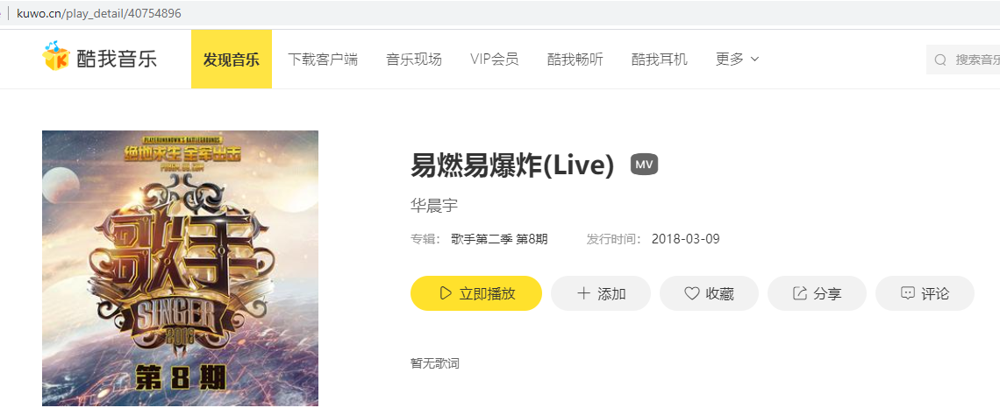

#下载音乐
网易云音乐下载  
酷我音乐下载

##入口py文件 -- music_main.py
有两种通道选择：  
&emsp;&emsp;网易云  
&emsp;&emsp;酷我

##ini配置文件 -- link.ini
~~~
[网易云]
;如果mainsongid为True，那么直接下载该歌曲，如果为False，那么就搜索歌手下载歌曲
mainsongid = True
songid = 327089
songname = 画心
;华晨宇
artistid = 861777
urlenter = https://music.163.com/artist?id=
urlsong = http://music.163.com/song/media/outer/url?id={}.mp3

[酷我]
;songname = 易燃易爆炸
;rid = 90104358
songname = 易燃易爆炸-华晨宇
rid = 40754896
~~~
##酷我音乐
酷我音乐网址：http://www.kuwo.cn/  
rid的获取方式：  
1.进入【酷狗音乐】官网  
2.搜索喜欢的音乐或者歌手  
3.点击自己喜欢的一首歌曲  
4.可以在网址栏看到网址最后有一串数字，这个就是rid  

